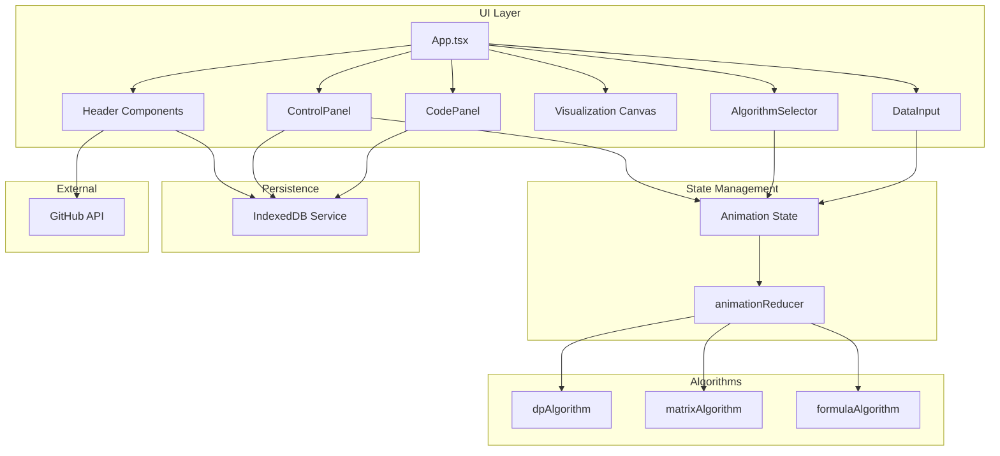

# Design Document

## Overview

本设计文档描述了 LeetCode 第70题「爬楼梯」算法可视化演示系统的增强方案。系统是一个基于 React + TypeScript + D3.js 的单页面应用，支持三种解法（动态规划、矩阵快速幂、通项公式）的分步动画演示。

### 核心目标
1. 提供直观的算法可视化体验，帮助用户理解算法执行过程
2. 支持多种编程语言的代码展示，带有调试效果
3. 提供灵活的播放控制，支持键盘快捷键
4. 使用 IndexedDB 持久化用户偏好设置

## Architecture



### 技术栈
- **前端框架**: React 19 + TypeScript
- **状态管理**: useReducer (轻量级，无需 Redux)
- **可视化**: D3.js + Canvas/SVG
- **样式**: styled-components
- **持久化**: IndexedDB
- **构建工具**: Vite
- **部署**: GitHub Pages + GitHub Actions

## Components and Interfaces

### 1. 页面布局组件

```typescript
// 页面整体布局
interface AppLayoutProps {
  children: React.ReactNode;
}

// 页头组件
interface HeaderProps {
  title: string;
  leetcodeUrl: string;
}

// 返回链接组件
interface BackToHot100Props {
  url: string;
}

// GitHub 徽标组件
interface GitHubCornerProps {
  repoUrl: string;
  apiUrl: string;
}
```

### 2. 数据输入组件

```typescript
interface DataInputProps {
  value: number;
  onChange: (value: number) => void;
  min: number;  // 1
  max: number;  // 45
  presets: number[];  // [2, 3, 5, 6, 10]
}

// 输入验证结果
interface ValidationResult {
  isValid: boolean;
  errorMessage?: string;
}
```

### 3. 算法选择器组件

```typescript
type AlgorithmType = 'dp' | 'matrix' | 'formula';

interface AlgorithmSelectorProps {
  currentAlgorithm: AlgorithmType;
  onSelect: (algorithm: AlgorithmType) => void;
  algorithms: {
    id: AlgorithmType;
    name: string;
    color: string;
  }[];
}
```

### 4. 代码面板组件

```typescript
type Language = 'java' | 'python' | 'golang' | 'javascript';

interface CodePanelProps {
  algorithm: AlgorithmType;
  currentStep: number;
  timeline: AnimationTimeline[];
}

interface CodeLineMapping {
  stepIndex: number;
  lineNumbers: {
    java: number[];
    python: number[];
    golang: number[];
    javascript: number[];
  };
  variables: {
    name: string;
    value: string | number;
  }[];
}
```

### 5. 可视化画布组件

```typescript
interface CanvasProps {
  width: number;
  height: number;
  algorithm: AlgorithmType;
  state: AnimationState;
  onZoom: (scale: number) => void;
  onPan: (x: number, y: number) => void;
}

// DP 可视化组件
interface DPVisualizerProps {
  n: number;
  currentStep: number;
  values: number[];
  stepStatuses: ('uncalculated' | 'calculating' | 'calculated')[];
}

// 矩阵可视化组件
interface MatrixVisualizerProps {
  n: number;
  currentStep: number;
  baseMatrix: number[][];
  resultMatrix: number[][];
  binaryBits: number[];
}

// 公式可视化组件
interface FormulaVisualizerProps {
  n: number;
  currentStep: number;
  phi: number;
  psi: number;
}
```

### 6. 控制面板组件

```typescript
interface ControlPanelProps {
  state: AnimationState;
  dispatch: React.Dispatch<AnimationAction>;
  onReset: () => void;
  onPlayPause: () => void;
  onPreviousStep: () => void;
  onNextStep: () => void;
  onStepChange: (step: number) => void;
  onSpeedChange: (speed: number) => void;
}

// 进度条组件
interface ProgressBarProps {
  currentStep: number;
  totalSteps: number;
  onSeek: (step: number) => void;
}
```

### 7. IndexedDB 服务接口

```typescript
interface IndexedDBService {
  // 语言偏好
  getLanguagePreference(): Promise<Language | null>;
  setLanguagePreference(lang: Language): Promise<void>;
  
  // 播放速度
  getPlaybackSpeed(): Promise<number | null>;
  setPlaybackSpeed(speed: number): Promise<void>;
  
  // GitHub Star 缓存
  getStarCache(): Promise<{ stars: number; timestamp: number } | null>;
  setStarCache(stars: number): Promise<void>;
  isStarCacheValid(cache: { timestamp: number }): boolean;
}
```

## Data Models

### 动画状态模型

```typescript
interface AnimationState {
  currentAlgorithm: 'dp' | 'matrix' | 'formula';
  isPlaying: boolean;
  currentStep: number;
  totalSteps: number;
  playbackSpeed: number;
  timeline: AnimationTimeline[];
  
  // DP 特有状态
  stepStatuses: ('uncalculated' | 'calculating' | 'calculated')[];
  values: number[];
  
  // 矩阵特有状态
  matrix: number[][];
  
  // 公式特有状态
  formula: string;
  
  // 动画控制
  animationInProgress: boolean;
}
```

### 时间线模型

```typescript
interface AnimationTimeline {
  timestamp: number;
  description: string;
  
  // 代码行映射
  codeLineMapping: {
    java: number[];
    python: number[];
    golang: number[];
    javascript: number[];
  };
  
  // 变量状态
  variables: {
    name: string;
    value: string | number;
    type: 'int' | 'array' | 'matrix';
  }[];
  
  // 可视化变更
  visualChanges: {
    nodeUpdates: { index: number; props: object }[];
    matrixUpdates: { row: number; col: number; value: number }[];
    formulaUpdate: string | null;
    arrows: { from: string; to: string; label: string }[];
  };
  
  // 解释说明
  explanation: {
    simple: string;
    detailed: string;
    expert: string;
  };
  
  // 代码片段
  code: string | null;
}
```

### 算法配置模型

```typescript
interface AlgorithmConfig {
  id: AlgorithmType;
  name: string;
  color: string;
  timeComplexity: string;
  spaceComplexity: string;
  description: string;
  
  // 代码模板
  codeTemplates: Record<Language, string>;
  
  // 生成时间线的函数
  generateTimeline: (n: number) => AnimationTimeline[];
}
```

## Correctness Properties

*A property is a characteristic or behavior that should hold true across all valid executions of a system-essentially, a formal statement about what the system should do. Properties serve as the bridge between human-readable specifications and machine-verifiable correctness guarantees.*

Based on the prework analysis, the following correctness properties have been identified:

### Property 1: GitHub Star Cache Validity
*For any* cached Star count with timestamp T, if the current time is within 1 hour of T, the system should return the cached value without making an API request; if the current time exceeds 1 hour from T, the system should make a new API request.
**Validates: Requirements 2.4**

### Property 2: Random Number Generation Range
*For any* invocation of the random generation function, the generated number should be an integer in the range [1, 45] inclusive.
**Validates: Requirements 3.6**

### Property 3: Input Validation Correctness
*For any* user input value V, if V is an integer in [1, 45], the validation should pass and allow algorithm execution; if V is outside this range or not a valid integer, the validation should fail and display an error message.
**Validates: Requirements 3.7, 3.8**

### Property 4: Algorithm Switch State Reset
*For any* algorithm switch from algorithm A to algorithm B, the animation state should be reset to step 0 with isPlaying set to false.
**Validates: Requirements 4.3**

### Property 5: Code Line Highlighting Consistency
*For any* animation step S with code line mapping M, the highlighted code lines should exactly match the lines specified in M for the currently selected language.
**Validates: Requirements 5.4**

### Property 6: Variable Display State Consistency
*For any* animation step S with variable state V, the displayed variable values in the code panel should exactly match the values in V.
**Validates: Requirements 5.5**

### Property 7: Language Preference Round-Trip
*For any* language selection L saved to IndexedDB, reading the preference back should return the same language L.
**Validates: Requirements 5.6, 5.7**

### Property 8: DP Stair Rendering Correctness
*For any* input n, the DP visualizer should render exactly n+1 stairs (including step 0), each displaying the correct DP value.
**Validates: Requirements 7.1**

### Property 9: DP Calculation Display Correctness
*For any* step calculating dp[i] where i >= 2, the visualization should display the formula dp[i] = dp[i-1] + dp[i-2] with the correct values.
**Validates: Requirements 7.3**

### Property 10: Binary Decomposition Correctness
*For any* input n, the binary representation displayed should equal n when converted back to decimal.
**Validates: Requirements 8.3**

### Property 11: Playback Speed Persistence Round-Trip
*For any* playback speed S saved to IndexedDB, reading the speed back should return the same value S.
**Validates: Requirements 10.6**

### Property 12: Progress Bar Step Mapping
*For any* progress bar position P (0-100%), dragging to P should set the current step to floor(P * totalSteps / 100).
**Validates: Requirements 10.8**

### Property 13: Algorithm-Specific Thoughts Display
*For any* selected algorithm A, the thoughts modal should display content specific to algorithm A, not content from other algorithms.
**Validates: Requirements 11.3**

### Property 14: No Purple Color Usage
*For any* rendered element in the DOM, its computed color values (color, background-color, border-color) should not contain purple hues (hue values between 270-330 degrees in HSL).
**Validates: Requirements 13.2**

## Error Handling

### 输入错误处理
- 非数字输入：显示「请输入有效数字」
- 超出范围：显示「最小值为 1」或「最大值为 45」
- 空输入：保持上一个有效值

### API 错误处理
- GitHub API 请求失败：使用 IndexedDB 缓存的旧值
- IndexedDB 不可用：使用内存缓存
- 网络超时：显示默认值 0

### 动画错误处理
- 步骤越界：自动限制在有效范围内
- 时间线为空：显示「准备开始动画演示」

## Testing Strategy

### 单元测试 (Unit Tests)
使用 Vitest 进行单元测试：

1. **算法函数测试**
   - 测试 DP 算法对特定输入的正确性
   - 测试矩阵乘法函数的正确性
   - 测试通项公式计算的精度

2. **工具函数测试**
   - 测试输入验证函数
   - 测试 IndexedDB 操作函数
   - 测试颜色转换函数

3. **组件测试**
   - 测试组件渲染
   - 测试用户交互响应

### 属性测试 (Property-Based Tests)
使用 fast-check 进行属性测试：

1. **缓存有效性属性测试**
   - 生成随机时间戳，验证缓存过期逻辑

2. **随机数生成属性测试**
   - 多次调用随机生成函数，验证结果范围

3. **输入验证属性测试**
   - 生成随机输入，验证验证逻辑的一致性

4. **状态重置属性测试**
   - 生成随机状态，验证重置后的状态正确性

5. **Round-Trip 属性测试**
   - 语言偏好的保存和读取
   - 播放速度的保存和读取

6. **DP 计算属性测试**
   - 验证 DP 数组值的正确性

7. **二进制分解属性测试**
   - 验证二进制表示的正确性

8. **进度条映射属性测试**
   - 验证进度条位置到步骤的映射

9. **颜色属性测试**
   - 验证所有颜色不包含紫色

### 测试配置
```typescript
// vitest.config.ts
export default {
  test: {
    environment: 'jsdom',
    globals: true,
    setupFiles: ['./src/test/setup.ts'],
  },
};

// Property test configuration
// Each property test should run at least 100 iterations
const FC_CONFIG = { numRuns: 100 };
```

### 测试标注格式
每个属性测试必须使用以下格式标注：
```typescript
/**
 * **Feature: algorithm-visualization-enhancement, Property 1: GitHub Star Cache Validity**
 * **Validates: Requirements 2.4**
 */
```
